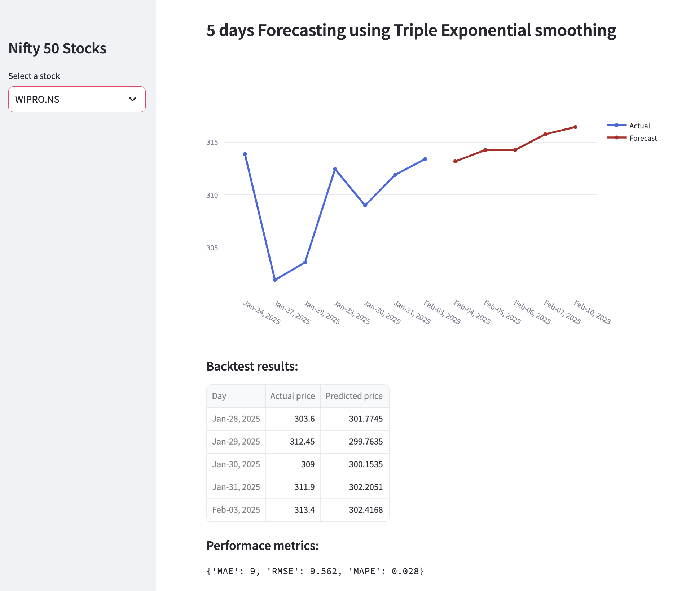

# Stock Forecasting App

Developed a stock forecasting app leveraging **Triple Exponential Smoothing** and **FB-Prophet** algorithms to forecast Nifty 50 stock prices over five days, achieving high accuracy with a backtested error under 5%.

**App Link**: [Nifty 50 Stock Forecasting App](https://nifty50-yh1s.onrender.com)

## Key Features:
- **Algorithms Used**: 
  - Triple Exponential Smoothing
  - FB-Prophet
- **Forecasting Horizon**: 5 days
- **Accuracy**: Backtested error under 5%

Feel free to explore the app for detailed stock forecasts.

